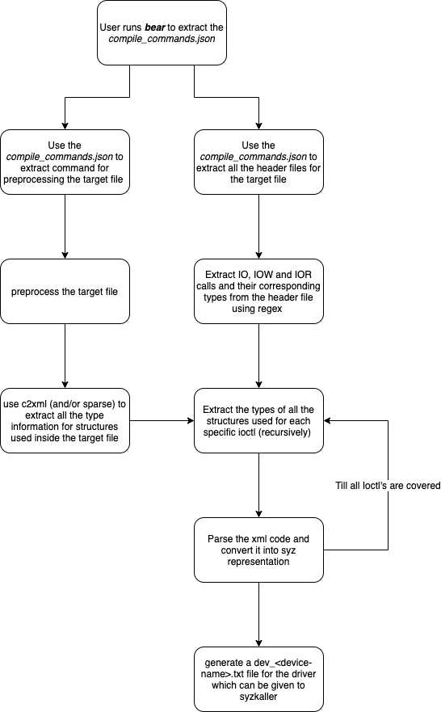

# Sys2Syz <!-- omit in toc -->

[](https://github.com/AshwAthi8/Project-NetwoFuz/blob/master/LICENSE)

## Overview <!-- omit in toc --> 

Sys2Syz is a tool which automates the conversion of syscalls and other Ioctl calls to [syzkaller's](https://github.com/google/syzkaller) representation. This tool was created with a motive of increasing the syscall coverage for leveling up the support of syzkaller for NetBSD. Currently, the tool only supports grammar generation for [NetBSD](https://github.com/NetBSD/src) (in future we plan to extend support for [Linux](https://github.com/torvalds/linux)).

## Table of Contents <!-- omit in toc -->

- [1. Reports](#1-reports)
- [2. Working](#2-working)
- [3. Installation](#3-installation)
  - [3.1. Dependencies](#31-dependencies)
  - [3.2. Build on Linux](#32-build-on-linux)
- [4. Usage](#4-usage)
- [5. Example](#5-example)
- [6. Features](#6-features)
- [7. TODO](#7-todo)

## 1. Reports

Below are the reports on the tool - written as a part of Google Summer of Code - 2020

- [Enhancing Syzkaller support for NetBSD - Part 1](https://blog.netbsd.org/tnf/entry/gsoc_reports_enhancing_syzkaller_support)
- [Enhancing Syzkaller support for NetBSD - Part 2](https://blog.netbsd.org/tnf/entry/gsoc_reports_enhancing_syzkaller_support1)
- [Enhancing Syzkaller support for NetBSD - Part 3](http://blog.netbsd.org/tnf/entry/google_summer_of_code_20202)

## 2. Working

Work flow of the tool -


     
The tool supports generation of syzkaller descriptions for NetBSD device driver's ioctl calls. Following steps are involved:

- Extraction of all ioctl commands of a given device driver along with their arguments from the header files. Ioctl commands in NetBSD can be identified with the help of some specific macros(`_IO`, `_IOR`, `_IOW`, `_IOWR`) - ([core/extractor.py](https://github.com/ais2397/sys2syz/blob/master/core/extractor.py)).
- Preprocessing of the device driver's files using compile_commands.json generated during the setup of tool using Bear - ([core/Bear.py](https://github.com/ais2397/sys2syz/blob/gsoc-2020/core/bear.py))
- XML files are generated by running c2xml on preprocessed device files. This eases the process of fetching the information related to arguments of commands - ([core/c2xml.py](https://github.com/ais2397/sys2syz/blob/master/core/c2xml.py))
- Generates descriptions for the ioctl commands and their arguments (builtin-types, arrays, pointers, structures and unions) using the XML files - ([core/description.py](https://github.com/ais2397/sys2syz/blob/master/core/description.py))
- Captures the filename for the file which defines the target syscall (uses ctags) - ([core/syscall.py](https://github.com/ais2397/sys2syz/blob/master/core/syscall.py))


## 3. Installation

Here are the installation instructions for Sys2syz

### Prerequisites

- Python 3.6+ 
- Linux 
- pip 

### 3.1. Dependencies

- [Bear](https://github.com/rizsotto/Bear) setup
- [CTags](https://github.com/universal-ctags/ctags)
- Kernel source files for the Operating system ([NetBSD](https://github.com/NetBSD/src)/ [Linux](https://github.com/torvalds/linux))

This tool is written in `python3`

### 3.2. Build on Linux

- Clone the repo
 ```shell
 git clone https://github.com/ais2397/sys2syz.git
 cd sys2syz
 ```
- Run the setup script

Initial setup to install the dependencies
 ```shell
 ./setup.sh -s
 ```

**Note:** For this step its mandatory to have the operating system toolchain.
-  `make clean` the kernel source directory before this step if you have previously built the kernel.

 ```shell
 ./setup.sh -b <operating_system> <path_to_kernel_src>
 ```
 
## 4. Usage

- Run the tool

 ```shell
 python3 sys2syz.py -h
```

To generate descriptions for ioctls of a device driver/syscall run sys2syz.py:
```shell
python3 sys2syz.py -i <syscall/ioctl> -t <absolute_path_to_device_driver_source/name_of_syscall> -c compile_commands.json -v -o <target_operating_system>
```

This would generate a ```dev_<device_driver>.txt``` file in the ```out/<target_operating_system>``` directory in case of ioctls and for syscalls it prints the generated descriptions on stdout.

## 5. Example

##### Running for NetBSD i2c device driver 

Command: 

```shell
python3 sys2syz.py -i ioctl -t ~/NetBSD/src/sys/dev/i2c -c compile_commands_dir/compile_commands_netbsd.json -v -o netbsd
```

Output file `dev_i2c.txt` in `out/netbsd`:

```txt
# Copyright 2018 syzkaller project authors. All rights reserved.
# Use of this source code is governed by Apache 2 LICENSE that can be found in the LICENSE file.
# Autogenerated by sys2syz

include <dev/i2c/i2c_io.h>

resource fd_i2c[fd]

openat$i2c(fd const[AT_FDCWD], file ptr[in, string["/dev/i2c"]], flags flags[open_flags], mode const[0]) fd_i2c

ioctl$I2C_IOCTL_EXEC(fd fd_i2c, cmd const[I2C_IOCTL_EXEC], arg ptr[in, i2c_ioctl_exec])

i2c_ioctl_exec {
iie_op	flags[i2c_op_t_flags, int8]
iie_addr	int16
iie_cmd	buffer[in]
iie_cmdlen	len[iie_cmd, intptr]
iie_buf	buffer[in]
iie_buflen	len[iie_buf, intptr]
}

i2c_op_t_flags
```
##### Running for NetBSD syscall 'compat_50_sys___lstat30'(syscall name: compat_50___lstat30):

Command:
```shell
python3 sys2syz.py -i syscall -t compat_50_sys___lstat30 -c compile_commands_dir/compile_commands_netbsd.json -v -o netbsd
```

Output:

```
compat_50_sys___lstat30(path buffer[in], ub ptr[out, stat30]) 

stat30 {
        st_dev  int32
        st_mode int32
        st_ino  intptr
        st_nlink        int32
        st_uid  int32
        st_gid  int32
        st_rdev int32
        st_atim timespec50
        st_mtim timespec50
        st_ctim timespec50
        st_birthtim     timespec50
        st_size intptr
        st_blocks       intptr
        st_blksize      int32
        st_flags        int32
        st_gen  int32
        st_spare        array[int32, 2]
}

timespec50 {
        tv_sec  int32
        tv_nsec intptr
}
```

## 6. Features

- Supports extraction of ioctl commands and their arguments from device drivers.
- Supports generation of descriptions for the ioctl commands and their arguments (builtin-types, arrays, pointers, structures and unions).
- Supports generation of descriptions for syscalls and their arguments (builtin-types, arrays, pointers, structures and unions).
- Generation of descriptions for functions, passed as arguments to the ioctl commands and syscalls.
- Suppoorts detection of flag values for the ioctl commands and syscalls.


## 7. TODO

Features yet to be implemented:

- [ ] Support for Linux
- [ ] Support for FreeBSD
- [ ] Calculating Attributes for structs and unions

This tool is developed by Ayushi Sharma
